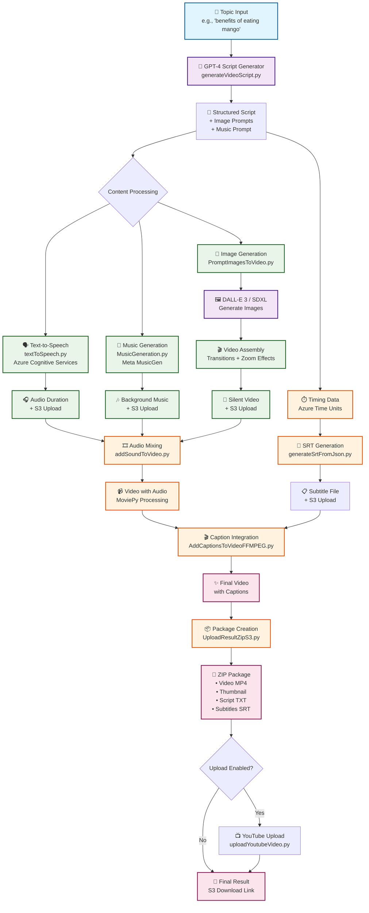

# AI Video Generator - Visual Pipeline Diagram

## Eraser.io Style Visual Flow



## Component Flow Breakdown

### Phase 1: Content Analysis & Generation
1. **Topic Input** → User provides topic string
2. **Script Generation** → GPT-4 analyzes and creates structured content
3. **Content Branching** → Script splits into multiple processing paths

### Phase 2: Parallel Asset Creation

#### Audio Track A: Narration
```
Script Text → Azure TTS → WAV Audio → Duration Calculation → S3 Storage
```

#### Audio Track B: Background Music  
```
Music Prompt → MusicGen AI → Audio File → S3 Storage
```

#### Visual Track: Image-to-Video
```
Image Prompts → AI Models → Individual Frames → Video Assembly → Silent MP4
```

### Phase 3: Integration & Synchronization
```
Narration + Music → Audio Mixing → Combined Audio Track
Combined Audio + Silent Video → Final Video with Sound
```

### Phase 4: Caption Processing
```
Script Timing → SRT Generation → Caption File → Video Integration
```

### Phase 5: Final Assembly
```
Video + Captions → Final MP4 → Package Creation → ZIP File → Distribution
```

## Key Processing Modules

| Module | Input | Output | Technology |
|--------|-------|--------|------------|
| `generateVideoScript.py` | Topic string | Structured JSON | GPT-4 + Mindsflow |
| `textToSpeech.py` | Script text | Audio WAV | Azure Cognitive Services |
| `MusicGeneration.py` | Music prompt | Audio file | Meta MusicGen |
| `PromptImagesToVideo.py` | Image prompts | Video MP4 | DALL-E 3 / SDXL |
| `addSoundToVideo.py` | Video + Audio | Mixed video | MoviePy |
| `generateSrtFromJson.py` | Timing JSON | SRT file | Python processing |
| `AddCaptionsToVideoFFMPEG.py` | Video + SRT | Final video | FFmpeg |

## Data Flow Paths

### Main Pipeline Path
```
Topic → Script → [Audio Branch] + [Visual Branch] → Integration → Captions → Final Video
```

### Alternative Processing Paths

#### Voice Cloning Path
```
Sample Audio → Voice Training → Custom Voice Model → Speech Generation
```

#### Translation Path
```
Source Content → Translation API → Target Language → Localized Output
```

#### Quality Enhancement Path
```
Raw Audio → Noise Reduction → Audio Segments → Enhanced Integration
```

## File Storage Architecture

```
S3 Bucket Structure:
├── ai-video/
│   ├── script_*.json          # Generated scripts
│   ├── audio_*.wav            # Narration files  
│   ├── video_*.mp4            # Generated videos
│   ├── *.srt                  # Subtitle files
│   └── final_*.zip            # Complete packages
└── temp_audio/
    └── *.wav                  # Temporary audio files
```

## Processing Timeline

| Step | Duration | Bottleneck | Optimization |
|------|----------|------------|--------------|
| Script Generation | ~30s | API calls | Parallel processing |
| Image Generation | ~2-5min | AI model inference | Batch processing |
| Audio Generation | ~30s | TTS processing | Async processing |
| Video Assembly | ~1-2min | MoviePy rendering | GPU acceleration |
| Caption Integration | ~30s | FFmpeg processing | Hardware encoding |

## System Dependencies

### External APIs
- **OpenAI GPT-4** - Script generation
- **Azure Cognitive Services** - Text-to-speech
- **Replicate** - AI model hosting (MusicGen, SDXL, etc.)
- **AWS S3** - File storage and delivery

### Local Processing
- **FFmpeg** - Video/audio manipulation
- **MoviePy** - Python video editing
- **OpenCV** - Computer vision operations
- **PIL** - Image processing

## Error Handling Flow

```
API Failure → Retry Logic (3x) → Fallback Model → Manual Intervention
File Upload Error → Retry Upload → Local Storage → S3 Sync Later
Processing Error → Log Error → Skip Step → Continue Pipeline
```

This visual pipeline provides a comprehensive overview of how the AI Video Generator transforms a simple text topic into a complete, professional video ready for social media distribution.